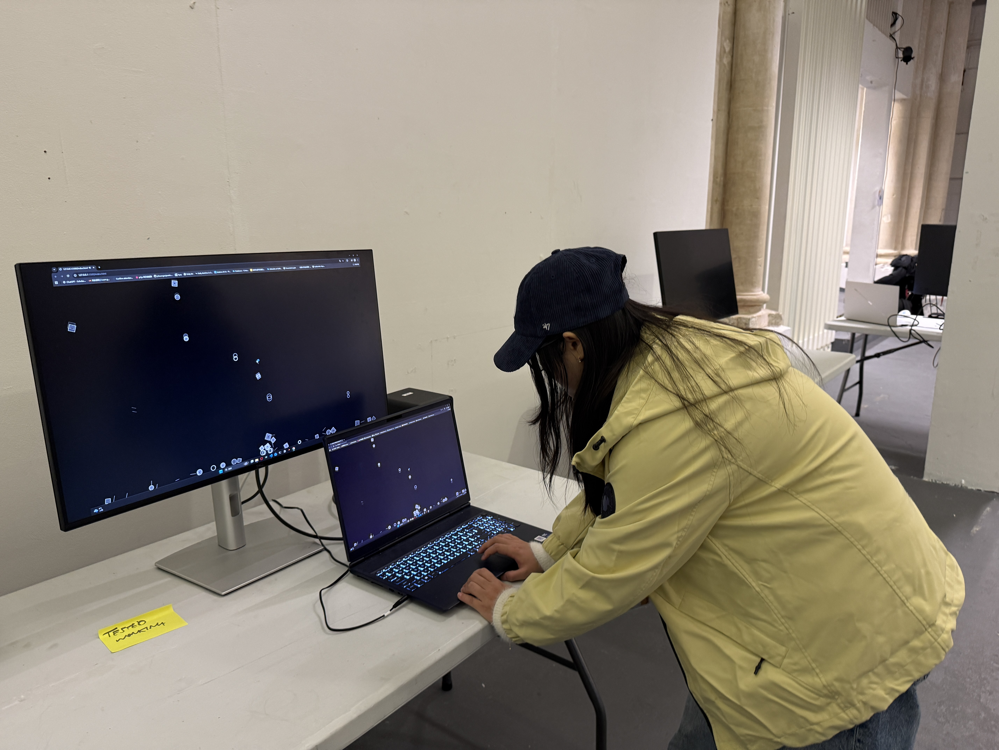
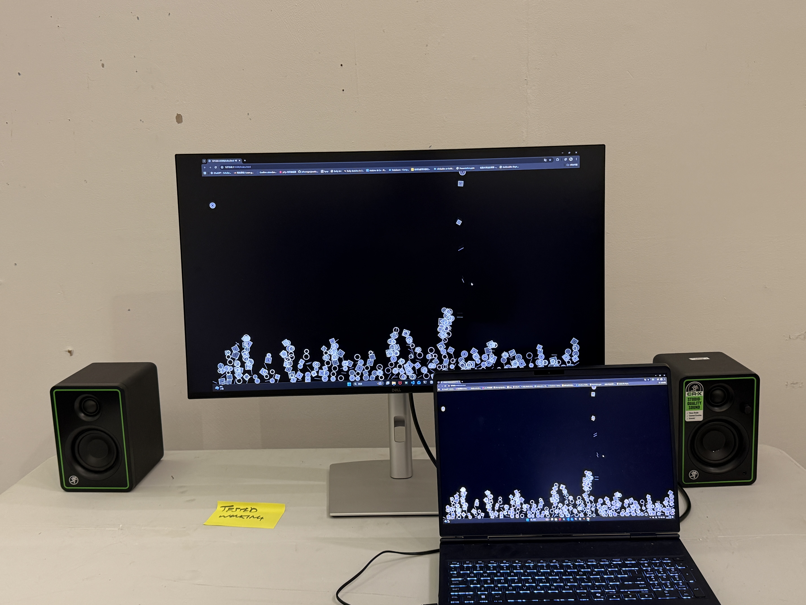
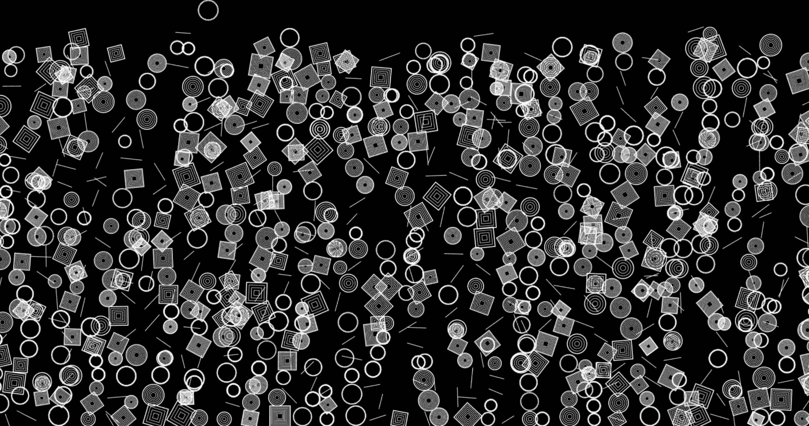

# ChronoLoop

## Short Description
*ChronoLoop is an interactive audiovisual system that visualizes the passage of time through falling geometric shapes and cyclical sound. It invites the viewer to experience time as both visual rhythm and sonic loop.*

## Concept 
*This project explores how abstract generative forms can embody time. Shapes fall from the top of the screen and gradually stack. When the stack reaches the top, the system "resets", beginning a new cycle—mirroring the cyclical and accumulative nature of time.*

*Each shape corresponds to a note in the Solfege scale (do–re–mi...) and is triggered upon collision. The volume of sound reflects how "full" the time is — fuller stacks = softer sounds.*

## Technology Used
- **p5.js** (visual rendering and interaction)
- **p5.sound** (Solfege note playback)
- Built as a web-based installation for browsers

## How to Run / Install
**ChronoLoop** is designed to be explored intuitively. Here's how:

| Action | What Happens |
|--------|--------------|
| 🖱️ **Click anywhere** | A new shape drops from the top |
| 🎶 **Each shape plays a sound** | Notes follow Do–Re–Mi–Fa–Sol–La–Si |
| 🧱 **Shapes stack naturally** | They fall and stop when touching others |
| ⏳ **When stack reaches the top** | All shapes clear & a new cycle begins |
| 🔉 **More shapes = Softer sounds** | The "fuller" the screen, the quieter the tone |

## Requirements
*The project runs on any browser across both macOS and Windows systems and features adaptive sizing.*

## Screenshots / Media

### Sketches

## Credits / Acknowledgements
Inspired by:

1.Ryoji Ikeda’s Test Pattern

2.Wu Guanzhong’s composition and brush rhythm

3.Vera Molnar’s geometric iterations

4.Mark Wilson’s algorithmic art

5.The Nature of Code by Daniel Shiffman

## Contact / Links
*Vimeo demo: https://vimeo.com/1153475102*

*GitHub: https://github.com/Jialinkook/ChronoLoop.git*

